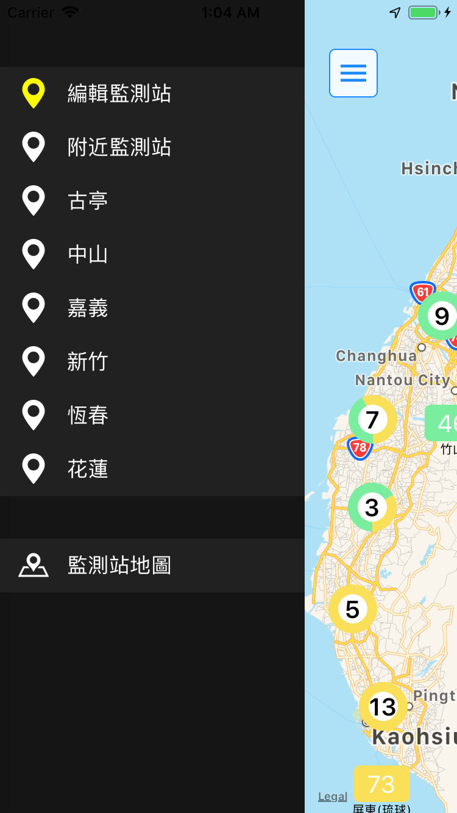

# 台灣空氣品質指標
> 在 iOS 平台上呈現關於台灣空氣的詳細資料，並將氣象站位置呈現於地圖中。
## 功能
* 呈現該氣象站台有關空氣資訊 : 
  * AQI
  * PM2.5 (μg/m³)
  * PM10 (μg/m³)
  * 一氧化碳(ppm)
  * 臭氧(ppb)
  * 二氧化硫 (ppb)
  * 二氧化碳（ppb）
  * 風速（m/sec）
  * 風向
* 台灣所有氣象站地圖位置
* 收藏特定氣象站台

## 操作畫面
<table>
    <tr>
        <td align="center">顯示氣象站空氣資訊</td>
        <td align="center">左側選單</td>
    </tr>
    <tr>
        <td>
            

                
            

        </td>
        <td>
            

                
            

        </td>
   </tr>
</table>
<table>
   <tr>
        <td align="center">編輯監測站</td>
        <td align="center">監測站地圖</td>
    </tr>
    <tr>
    <tr>
        <td>
            

                
            

        </td>
        <td>
            

                
            

        </td>
   </tr>
</table>

> 站台顯示密度太高，會自動合併成叢集圖標，並顯示叢集中有多少站台。

> 點擊叢集圖標可以自動拉近地圖，顯示站台們。

## 線上使用 App
* [Appetize](https://pros.is/NKBD9)

## 使用第三方Library
* [Alamofire](https://github.com/Alamofire/Alamofire)
* [PromiseKit](https://github.com/mxcl/PromiseKit)
* [Realm](https://realm.io/docs/swift/latest)
* [SideMenu](https://github.com/jonkykong/SideMenu)
* [Parchment](https://github.com/rechsteiner/Parchment)

## 參考資料
* API : [政府資料開放平臺-空氣品質指標 (AQI)](https://pros.is/KBFJS)
* UI 畫面 :
  * [Apple Weather](https://pros.is/LSNW6)
  * [Yahoo Weather](https://pros.is/N632D)
